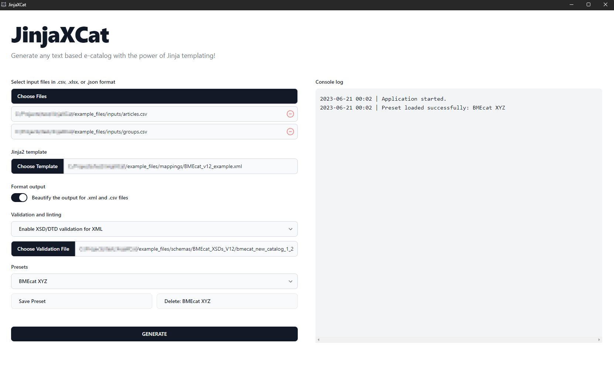

# JinjaXCat
JinjaXCat is a powerful tool designed to simplify the process of creating any text-based catalogs.
It utilizes the Jinja2 templating engine to dynamically generate catalog content, offering control through either a Command Line Interface (CLI) or a Graphic User Interface (GUI).
JinjaXCat can parse data from CSV, Excel, or JSON files, allowing for a wide range of use cases.

## Project Background and Motivation
JinjaXCat was developed in response to a need for a straightforward and effective solution for generating any text-based catalog files, particularly BMEcat XML catalogs.
It offers customizable approach compared to existing BMEcat converters like the OpenSource BMEcat Converter.

The strength of JinjaXCat lies in its use of the Jinja2 templating engine, making it a versatile and powerful tool for catalog generation.
Unlike the OpenSource BMEcat Converter and similar tools, JinjaXCat aims to provide a fully customizable approach by utilizing templates.

## Getting Started

### Prerequisites
Before installing and using JinjaXCat, ensure that Python and Git are installed on your computer.
If your intention is to use a pre-built executable, you can skip both the installation and building steps for executables.

### Installation
To install JinjaXCat via the command line, please follow the steps below.


Clone the repository to your local machine:

```
git clone https://github.com/maRT-sk/jinjaxcat.git
cd jinjaxcat
```

Set up a new Python virtual environment:

```
$ python3 -m venv venv
```

Activate the virtual environment:

```
# Windows
$ path\to\venv\Scripts\activate.bat
# Unix
$ source path/to/venv//bin/activate
```

Install the necessary dependencies:

```
pip install -r requirements.txt
```

## Building the Executable

To package JinjaXCat into an executable file that can be run without a Python interpreter, you can use PyInstaller.

Use the following command:
```
python -m eel jinjaxcat_start.py jinjaxcat --onefile --icon=.\jinjaxcat\gui\favicon.ico
```

If you have made changes to the Tailwind CSS classes, remember to build a new CSS file. Install Tailwind CSS via npm:
```
npm install -D tailwindcss
npx tailwindcss init
```

The configuration is already set up in `tailwind.config.js`. You can start the Tailwind CLI build process:
```
tailwindcss -i ./jinjaxcat/gui/input-tailwind.css -o ./jinjaxcat/gui/output-tailwind.css --watch
```

## Running JinjaXCat
Once you have set up the environment, you can run JinjaXCat using either the command-line interface (CLI) or the provided graphical user interface (GUI).
Ensure that you run these commands from within the virtual environment where all the necessary dependencies have been installed.

If you have already built the executable version of JinjaXCat, you can directly run the executable file without the need for the Python interpreter.

### GUI Mode

Running JinjaXCat via the Graphical User Interface (GUI) is easier and more user-friendly.
To launch the GUI application, navigate to the project's directory and run the following command:

```
python jinjaxcat_start.py
```

The GUI will be started as shown below:


### CLI Mocde

You can run the JinjaXCat directly from the command line. Navigate to the project's directory and run the following
command:
```
python jinjaxcat_start.py --input_files INPUT_FILES --template_name TEMPLATE_NAME --output_file_name OUTPUT_FILE_NAME --is_prettify_output IS_PRETTIFIED --validation_type VALIDATION_TYPE --validation_file VALIDATION_FILE
```

Replace the all-capital parameters with your actual values.

#### Required parameters:

- **INPUT_FILES:** Path(s) to one or more input files containing data to be rendered into the template.
- **TEMPLATE_NAME:** Path to the Jinja2 template file that defines the structure of the input data.
- **OUTPUT_FILE_NAME:** Path to the output file where the rendered template will be written.

#### Optional parameters:

- **IS_PRETTIFIED:** Set this flag to True if you want the output to be formatted for readability. The default value
  is `False`.
- **VALIDATION_TYPE:** Set the output validation type. Use "xml" or "json" for output validation. The default value
  is `None`.
- **VALIDATION_FILE:** If validation is required, provide the path to the XSD/DTD schema for output validation. The
  default value is `None`.

## How to Render Input File Content to Template

JinjaXCat allows you to include data from multiple file types into the template.
You can use different file types simultaneously to generate a comprehensive output.

### CSV input files

To access the data from a CSV file in the template, use the file name (without the suffix) as a variable.
For example, if you have an Articles.csv, you can access respective columns in the template as follows:
```

{{ article['COLUMN_NAME'] }}

```

Replace 'COLUMN_NAME' with the actual column name from the respective CSV file that you want to include in the rendered
output.

### JSON Input Files
Similar to CSV files, each JSON file serves as a separate data source. In the
template, you can access the data from a JSON file using the file name (without the suffix) as a variable.

For example, if you have a data.json file, you can access its properties in the template as follows:
```

{{ article['PROPERTY_NAME'] }}

```

Replace 'PROPERTY_NAME' with the actual property name from the JSON file that you want to include in the rendered
output.

### Excel Input Files
Excel files contain multiple sheets, each representing a separate data source. To access the data from different sheets
in the template, combine the file name (without the suffix) with the sheet name using an underscore (_) as a separator.
For example, if you have an example.xlsx file with two sheets named Sheet1 and Sheet2, you can access their respective
data in the template as follows:

```

{{ row['COLUMN_NAME'] }}



{{ row['COLUMN_NAME'] }}

```

Replace 'COLUMN_NAME' with the actual column name from the respective sheet that you want to include in the rendered
output.

## Jinja2 Filters in Templates

JinjaXCat provides [builtin Jinja2 filters](https://jinja.palletsprojects.com/en/3.1.x/templates/#builtin-filters)  that
you can use to manipulate and format data within your templates.
These filters are readily available and can be used out of the box.

In addition to the default filters, JinjaXCat also includes prebuilt custom filters and globals.
These filters and variables are specifically designed to enhance the capabilities of the templating engine and provide
additional functionality to your templates
Some of the prebuilt filters and globals available in JinjaXCat include:

- remove_accents: A filter that removes accents from text, useful for normalizing and cleaning up strings.
- current_datetime: A global that returns the current date and time, providing you with real-time information within
  your templates.
- custom_date: A global that allows you to generate custom-formatted dates, giving you control over the date
  representation in your templates.
- log: A global that enables logging within your templates, allowing you to output messages or debug information during
  the rendering process.
- get_status_code: A global that retrieves the status code of an HTTP request, useful for fetching status_code from
  external APIs or web services.
- get_groups_with_articles: A global that retrieves groups with associated articles, useful for BMEcat catalogs to
  filter out groups without any articles.

As a developer, you can add custom filters and globals to JinjaXCat.
Simply define and register them within the CustomEnvironment class in the `.\jinjaxcat\logic\environment.py` file.
This allows you to enhance the templating engine to meet your specific needs and requirements.

Showcases the usage of filters and globals within a JinjaXCat template:

```XML
 
<ARTICLE>
    <SUPPLIER_AID>{{article['SUPPLIER_AID']}}</SUPPLIER_AID>
    <ARTICLE_DETAILS>
        <!-- Apply the custom 'remove_accents' filter to remove all accent marks from the current article  -->
        <DESCRIPTION_SHORT>{{article['DESCRIPTION_SHORT']|remove_accents }}</DESCRIPTION_SHORT>
        <!-- Display the first fifty characters of the current 'article' within the 'DESCRIPTION_LONG' tags. -->
        <DESCRIPTION_LONG>{{article['DESCRIPTION_LONG'][:50]}}</DESCRIPTION_LONG>
        <!-- Apply the 'int' filter to PRICE_QUANTITY, converting the value to an integer.  -->
        <PRICE_QUANTITY>{{article['PRICE_QUANTITY']|int}}</PRICE_QUANTITY>
        <!-- Apply the 'float' filter to PRICE_AMOUNT, converting the value to a float value.  -->
        <PRICE_AMOUNT>{{article['PRICE_AMOUNT']|float}}</PRICE_AMOUNT>
        <!-- Use the custom custom_date function to create a date with specific values. 
        Format the returned date object to a string in "YYYY-MM-DD". -->
        <VALID_FROM>{{ custom_date(2025, 1, 5).strftime("%Y-%m-%d") }}</VALID_FROM>
        <DELIVERY_TIME>{{article['DELIVERY_TIME']}}</DELIVERY_TIME>
        <!-- Begin iterating over each 'keyword' in the current 'article's 'KEYWORDS' attribute.
        The 'KEYWORDS' attribute is a comma-separated string, which is split into individual keywords for the loop. -->
        
        <KEYWORD>{{keyword.strip()}}</KEYWORD>
        
    </ARTICLE_DETAILS>
    <!-- Log SUPPLIER_AID to console  -->
    {{ log(article['SUPPLIER_AID']) }}
</ARTICLE>
```

## Output Files

JinjaXCat provides the flexibility to generate any text-based output files in multiple formats based on your specific
requirements. You can define templates using the Jinja2 syntax and render data from your input files into the desired
format.
For example, you can generate CSV, TXT, XML, JSON, or any other text-based file formats.
To create a template for a specific file format, define the structure and content using the appropriate syntax.
Customize the template to include placeholders and tags that will be replaced with the actual data during the rendering
process. Here's an example of a template for a CSV file:

```csv
Supplier ID; Article ID; EAN Code; Description

    Supplier123;{{ article['SUPPLIER_AID'] }};{{ article['EAN'] }};{{ article['DESCRIPTION_SHORT'] }}

```

In this example, each row in the CSV file represents an article, with columns corresponding to attributes such as
Supplier ID, Article ID, EAN Code, and Description.
You can adapt this template or create new templates to match the desired structure and format for your text-based output
files.
With JinjaXCat, you have the flexibility to generate a wide range of text-based output files, allowing you to seamlessly
integrate the generated content into your workflows or applications.

## Development Status
JinjaXCat is currently under active development, and certain features and functionalities may be subject to change.
At present, the most extensively tested and supported functionality in JinjaXCat is the generation of XML-based catalogs
from CSV input files.
As development progresses, additional features, improvements, and support for more file formats may be added. 
Excel outputs are undergoing testing, but challenges arise due to their non-text nature.

Your feedback and contributions are greatly appreciated in helping to shape and enhance the JinjaXCat project.
Please exercise caution when using JinjaXCat in production environments, as the project is still in the ongoing development phase.